# Instrukcja dla pracy domowej
## Tydzień 5

#### Opis

W tym tyogniu poznałeś sposoby deployowania aplikacji na róznych środowiskach. Potrafisz przejrzeć historię rolloutów. Wiesz jak dokonać rollback. 

Czas przećwiczyć to w praktyce. Powodzenia!

Po wykonaniu każdego zadania, podziel się proszę wynikami na naszej grupie na Facebooku.

#### Przygotowanie środowiska pracy

1. Najpierw utwórz **Namespace**, w którym będziesz wykonywać wszystkie ćwiczenia:

    ``
    kubectl create namespace homework8
    ``

2. Zmień aktualny **Context** dla kubectl na ten nowo utworzony:

    `` kubectl config set-context --current --namespace=homework8``

Tak przy okazji, polecam fajne narzędzia do przełączania się pomiędzu kontekstami i przestrzeniami nazw. [kubectx i kubens](https://github.com/ahmetb/kubectx) naprawdę pomagają.


## Zadanie 1: Wykonaj Deployment i utwórz ReplicaSet.

1. Utwórz nowy plik o nazwie 
```
nano depl.yaml
```
2. Ściągnij [manifest file](./files/depl.yaml)  i wklej jego zawartość do utworzonego pliku.
3. Zapisz zmiany i wykonaj polecenie:
```
kubectl apply -f depl.yaml
```

## Zadanie 2: Sprawdzanie deploymentu

1. Wykonaj polecenie 
```
kubectl get deployments
``` 
i sprawdź, czy deployment utworzył się prawidłowo.
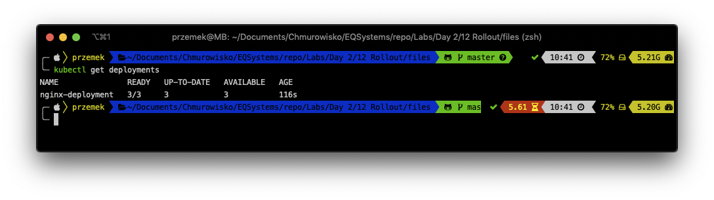

2. Jeżeli Deployment nie jest jeszcze gotowy, możesz sprawdzić jego status za pomocą polecenia:
```
kubectl rollout status deployment nginx-deployment
```
i ponownie wykonać 
```
kubectl get deployments
``` 
po kilku sekundach.

Aby zobaczyć utworzony ReplcaSet utworzony za pomocą RollOutu wykonaj polecenie ```
kubectl get rs```

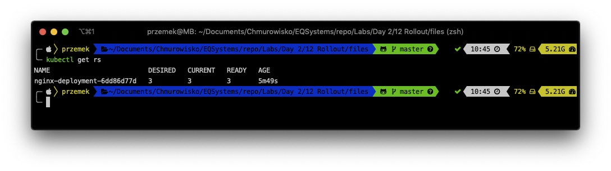

3. Możesz także przejrzeć labele utworzone automatycznie dla każdego Poda:
```
kubectl get pods --show-labels
```
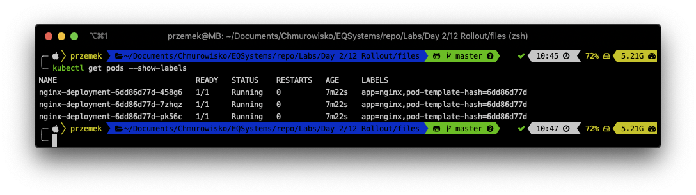
4. Wybierz jeden z utworzonych Podów i zestaw do niego proxy
```
kubectl port-forward <-YOUR-POD-NAME-> 8080:80
```
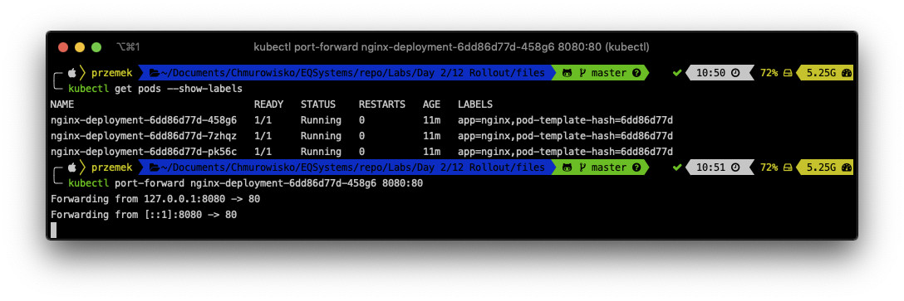
5. Podłącz się do nginx używając jakiejkolwieg przeglądarki.
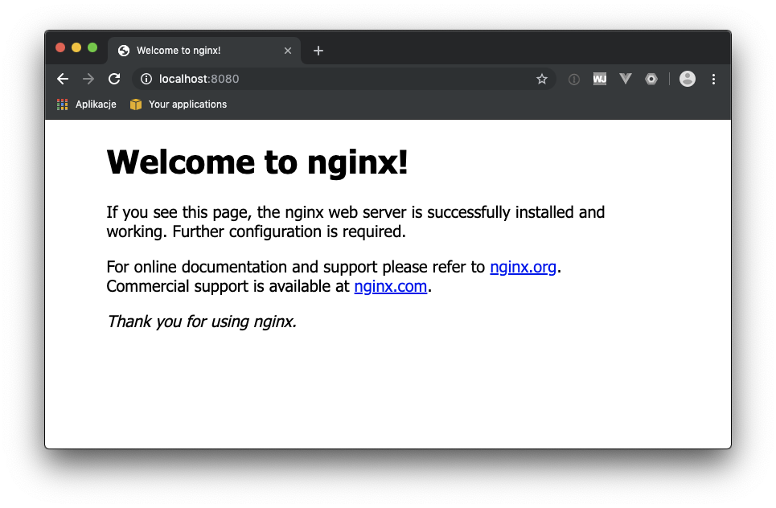
<br><br>
Możesz także użyć *curl* i przejrzeć zwracana nagłówki. zyj innego okna terminala: 
```
curl -I -X GET http://localhost:8080
```
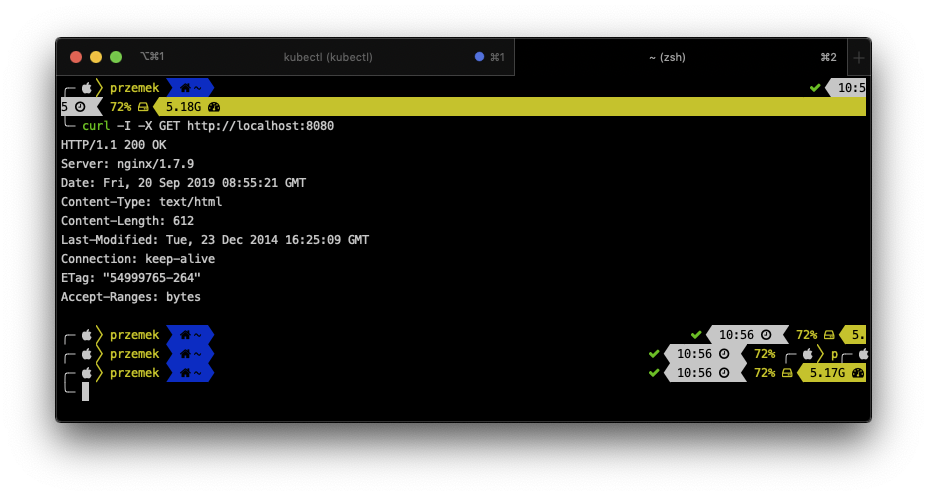

Jak widzisz, używasz nginx 1.7.9

W pierwszym terminalu wyłącz proxy **CTRL+C**.

## Zadanie 3: Uaktualnienie Deploymentu

1. Uruchom w terminalu:
```
kubectl --record deployment.apps/nginx-deployment set image deployment.v1.apps/nginx-deployment nginx=nginx:1.9.1
```

2. Sprawdź status Deploymentu: 

```
kubectl rollout status deployment.v1.apps/nginx-deployment
```

3. Pobierz listę ReplicaSets:

```
kubectl get rs
```
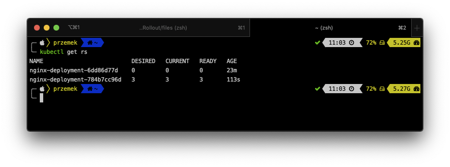

4. Ponownie utwórz proxy do jednego ze swoich Podów: 
```
kubectl port-forward <-YOUR-POD-NAME-> 8080:80
```
5. Ponownie użyj *curl** do sprawdzenia nagłówków odpowiedzi:
``
curl -I -X GET http://localhost:8080
``
Tym razem powinna to być wersja 1.9.1.
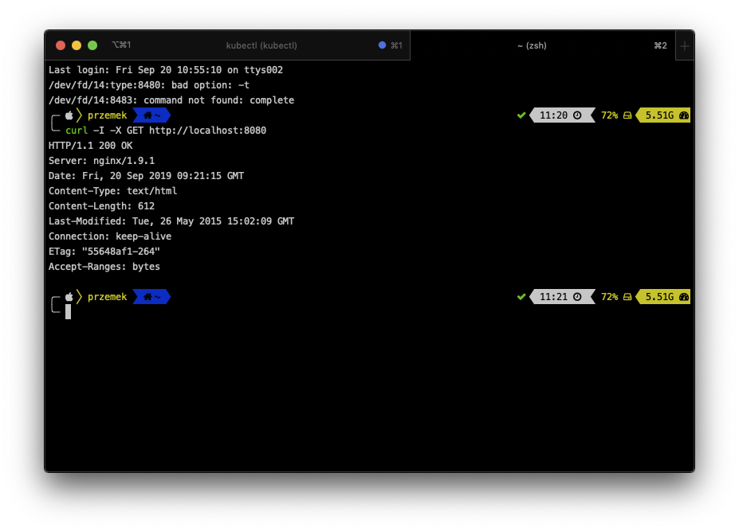
6. Otwórz plik manifestu (depl.yaml):

i edytuj plik
* ustaw *replicas* na: 5
* ustaw *image* na: nginx:1.17.3
* dodaj
```
strategy:
  rollingUpdate:
    maxSurge: 1
    maxUnavailable: 1
  type: RollingUpdate
```
do **spec**
* dodaj annotację

```
annotations:
  kubernetes.io/change-cause: "Image change"
```
do **metadata**.

Możesz sprawdzić plik [depl2.yaml file](./files/depl2.yaml), jest tam dotowe rozwiązanie.

7. wykonaj update Deploymentu za pomocą polecenia 
```
kubectl apply -f depl.yaml
``` 
lub 
```
kubectl apply -f depl2.yaml
```

Po chwili będziesz miał 5 Podów pracujących w Deploymencie.

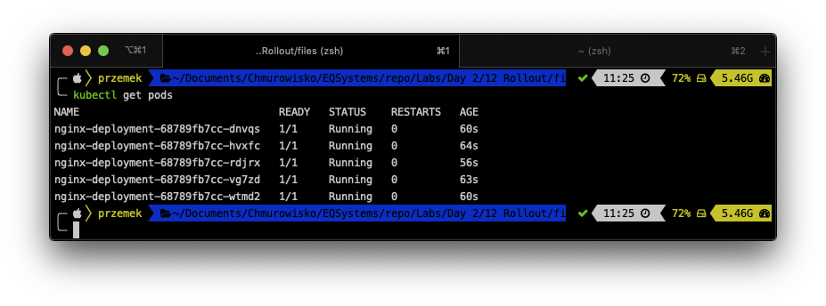

## Task 4: Zarządzanie historią Rolloutów

1. Pobierz historię Deploymentów za pomocą polecenia:

```
kubectl rollout history deployment nginx-deployment
```
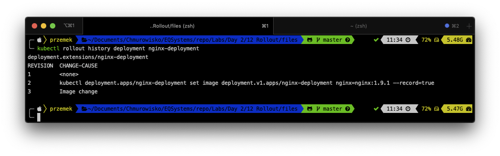

2. Jeżeli chcesz poznać więcej informacji na temat konkretnego rolloutu dodaj flagę *--revision*:

```
kubectl rollout history deployment nginx-deployment --revision=2
```

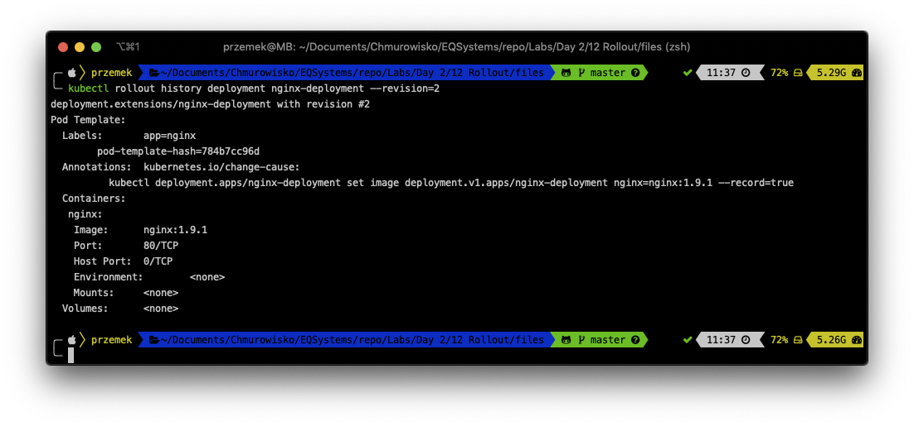

3. Wycofaj ostatni Rollout:

```
kubectl rollout undo deployments nginx-deployment
```
4. Sprawdź historię

```
kubectl rollout history deployment nginx-deployment
```


Jak widzisz, zniknął Rollout 2, a został dodany Rollout 4. Mame teraz rewizje 1,3 i 4.

5. Wykonaj Rollback do rewizhi 3:
```
kubectl rollout undo deployments nginx-deployment --to-revision=3
```
i sprawdź historię: 
```
kubectl rollout history deployment nginx-deployment
```
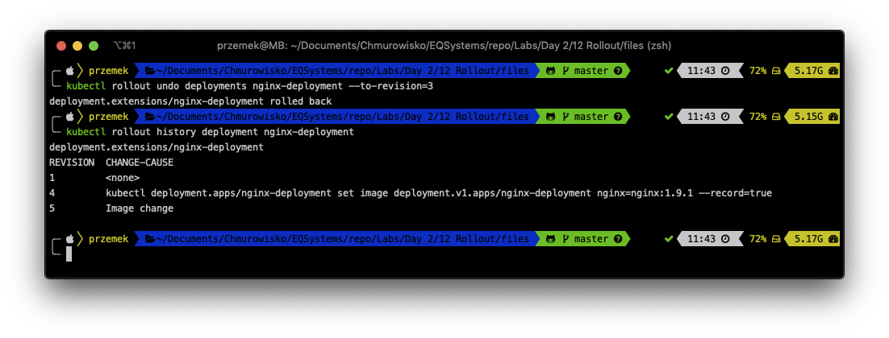

6. Usuń cały deployment:
```
kubectl delete deployment nginx-deployment
```

## END LAB
<center><p>&copy; 2019 Chmurowisko Sp. z o.o.<p></center>
