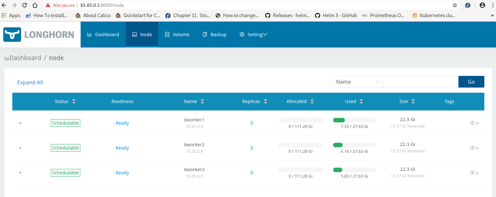
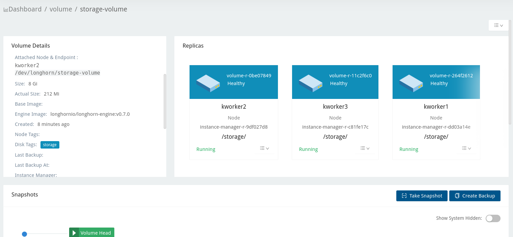

## Longhorn deployment on local cluster
(The yaml file in this folder can be used to deploy longhorn with `kubectl create -f..` command)

1) Download longhorn helm chart package with `git clone https://github.com/longhorn/longhorn.git`
2) Change kind to NodePort in the Service definition in the *values.yaml*
3) Create *longhorn-system* namespace: `kubectl create longhorn-system`
4) Get to the longhorn helm chart folder, install longhorn with Helm: `helm install longhorn . --namespace longhorn-system`
5) Check out the deployment (takes about 3 minutes to get accomplished): `kubectl get po -n longhorn-system -o wide`

	- total storage layout across the nodes:
	

	- storage persistency:
	

